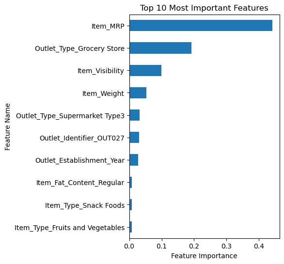

# Predicting Product Sales
## Analysis of MRP and related columns to identify methods of boosting sales 

**Author**: Matt S.

### Business problem:
Determine sales for food items based off of the store and see which properties are more applicable for generating more sales.


### Data:
Data dictionary:
| Variable Name	| Description |
|:-------------:|:-----------:|
|Item_Identifier	| Product ID |
|Item_Weight | Weight of product |
|Item_Fat_Content	| Whether the product is low-fat or regular|
|Item_Visibility | The percentage of total display area of all products in a store allocated to the particular product |
|Item_Type | The category to which the product belongs |
|Item_MRP	Maximum | Retail Price (list price) of the product |
|Outlet_Identifier | Store ID |
|Outlet_Establishment_Year | The year in which store was established |
|Outlet_Size | The size of the store in terms of ground area covered |
|Outlet_Location_Type | The type of area in which the store is located |
|Outlet_Type | Whether the outlet is a grocery store or some sort of supermarket |
|Item_Outlet_Sales | Sales of the product in the particular store. This is the target variable to be predicted. |


## Methods
Muliple steps were taken to prepare and review the data including:
- Initial data inspection and cleaning
- Exploratory Data Analysis
- Explanatory Data Analysis
- Data pre-processing for ML after exploratory and explanatory analysis
- Linear regression, decision tree, and random forest modeling

## Results
### Outlet_Sales vs Outlet_Type

- Supermarket Type 3 generates many more sales than its Type1 and Type2 counterparts. Grocery stores have a very low amount of sales.

### Outlet_Sales vs Item_MRP

-  Surprisingly, the higher the MRP, the higher the amount of sales. It was initially expected that lower MRP items would have more sales due to easier purchasability of consumers.
- Further investigation into the more popular items can be determined by sorting items by their MRP.

## Model
Models used:
```
- Linear Regression
- Decision Tree
- Tuned Decision Tree
- Random Forest
- Tuned Random Forest
```
### Linear Regression Insights
**Linear Regression Coefficients:**


- **The top 3 coefficients are:** Outlet_Type_Supermarket Type 3, Outlet_Identifier_OUT027, and Outlet_Size_Medium
  - Stores identified as Outlet_Type_Supermarket Type3 see an increase item sales by $588.235
  - Stores identified as Outlet_Identifier_Medium see an increase item sales by $588.235
  - Stores identified as Outlet_Size_Medium see an increase of item sales by $421.406

- **The top 3 negative coefficients are:**
  - Outlet_Identifier_OUT010: Stores with this identifier have a drop in sales by $470.065
  - Outlet_Identifier_OUT019: Stores with this identifier have a drop in sales by $469.809
  - Outlet_Type_Grocery_Store: Stores with this identifier have a drop in sales by $895.874.


### Random Forest Feature Importances
**Important features in Random Forest:**


Top 5 most important features:
- Item_MRP
- Outlet_Type_Grocery_Store
- Item_Visibility
- Item_Weight
- Outlet_Type_Supermarket Type3

### SHAP Plot Interpretations
**SHAP Bar Plot**

The SHAP plot and feature importances are both very similar.
- In both plots, Item_MRP is the top feature used
- Outlet_Type_GroceryStore is 2nd for both

The differences begin with the third row.
- The SHAP plot shows Item_Visibility at 5th but in the feature importance, it is ranked 3rd.
- Item_Weight is outside of the top 5 in the SHAP but is ranked 4th in the important features.

Overall, the top 5 majority of features are the same.

**SHAP Dot Plot**

- Top three features:
    - Item_MRP
      - The plot shows a larger amount of high values on the right side of the plot. This means that higher values in this feature will increase sales.
    - Outlet_Type_Grocery
      - The majority of high values for this feature are on the left-hand side of the plot. Items sold from outlets identified as grocery stores will sell for a lesser amount.
    - Outlet_Type_Supermarket 3
      - There is a high concentraion of high values on the right-hand side of the plot. Items sold from outlets identified as supermarket 3 will see more sales.

### Final Model Output
Linear Regression Training Scores:

Results for training data:
  - R^2 = 0.562
  - MAE = 847.126
  - MSE = 1297557.55
  - RMSE = 1139.104

Results for testing data:
  - R^2 = 0.567
  - MAE = 804.119
  - MSE = 1194350.684
  - RMSE = 1092.864

-------
Decision Tree Training Scores:

Results for training data:
  - R^2 = 0.604
  - MAE = 762.61
  - MSE = 1172122.773
  - RMSE = 1082.646

Results for testing data:
  - R^2 = 0.595
  - MAE = 738.317
  - MSE = 1118185.973
  - RMSE = 1057.443

-------
Random Forest Training Scores:

Results for training data:
  - R^2 = 0.938
  - MAE = 296.606
  - MSE = 182863.811
  - RMSE = 427.626

Results for testing data:
  - R^2 = 0.56
  - MAE = 766.068
  - MSE = 1214585.128
  - RMSE = 1102.082


- Linear regression has an overall low R2 of training 56%/testing 57%
- Decision tree has an overall low R2 of 60%/testing 59%
- Random forest has a major overfitting issue as indicated by the high training R2 of 93% but low testing R2 of 56%.

All models need further experimenting with tuning in their current state. The best model at the moment is the decision tree model, as it offers a near 1:1 R2 for both training, albeit at 60%.

The decision tree and random forest are both contenders for best models after further tuning is done.

## Recommendations:
Continue tuning the models, as the current results are not at acceptable levels.


## Limitations & Next Steps
- Refactor code to be more modular (move code into functions etc.)
- Continue tuning decision tree and random forest model
- Refer to "To-Do" section in notebook for in-depth next steps
